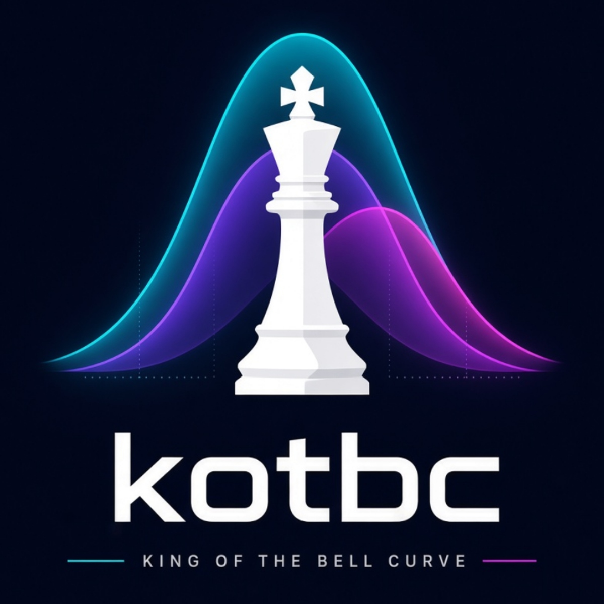

  

A PyTorch-based Value-Network Chess AI trained on standard PGN game datasets. The engine learns board evaluation directly from master game outcomes and performs real-time shallow search to choose optimal moves.

---

## 1. System Architecture & Technical Specifications

### Board Representation (Tensor Encoding)

The board state is encoded into a 12 × 8 × 8 binary/signed feature tensor (768 total inputs) via board_to_array():

- Channels 0–11: Allocated in pairs across piece types (P, N, B, R, Q, K).
  - Channel 2k (Sign / Ownership): +1.0 for Black pieces, -1.0 for White pieces.
  - Channel 2k + 1 (Occupancy Mask): +1.0 if a piece of that type is present on the square, 0.0 otherwise.

### Neural Network Architecture (ChessModel)

- Input Layer: 768 flattened inputs (12 x 8 x 8).
- Hidden Layer 1: Fully connected linear transformation 768 -> 256 followed by Sigmoid activation.
- Output Layer: Linear projection 256 -> 1 representing the unnormalized logit of White's win probability.
- Loss Function: nn.BCEWithLogitsLoss() against ground-truth labels:
  - White Win (1-0): 1.0
  - Draw (1/2-1/2): 0.5
  - Black Win (0-1): 0.0

### Inference & Move Selection

During inference (play.py and play_stockfish.py), the model acts as an evaluation heuristic inside a 1-ply search:

1. All legal candidate moves are generated via python-chess.
2. Each hypothetical post-move board state is pushed to the board, converted to a tensor, and evaluated under torch.no_grad().
3. The engine selects the move maximizing the state evaluation score.

---

## 2. Environment Setup (Windows 11 + AMD / DirectML)

This project uses Python 3.12 and Microsoft DirectML to provide native DirectX 12 hardware acceleration across non-NVIDIA GPUs (e.g., AMD Radeon GPUs on Windows Boot Camp).

### Step-by-Step Installation

1. Open Anaconda Prompt and create the environment:
   conda create -n kotbc python=3.12 -y
   conda activate kotbc

2. Install dependencies:
   pip install -r requirements.txt

3. Verify hardware acceleration:
   python -c "import torch_directml; d = torch_directml.device(); print('Using Device:', torch_directml.device_name(d.index))"

---

## 3. Dataset Preparation

The training loader parses standard .pgn files recursively and extracts board states from all mainline moves.

1. Download master game collections in .pgn format (e.g., from Lichess Open Database).
2. Place your raw .pgn files inside the chess_ai/data/ directory:
   kotbc/
   └── chess_ai/
   └── data/
   ├── lichess_elite_2023.pgn
   └── tournament_games.pgn

Note: Games missing a definitive result header (\*) are automatically ignored during parsing.

---

## 4. Training

Navigate to the chess_ai/ directory:
cd chess_ai

Execute train.py with positional arguments:
python train.py <data_folder> <epochs> <batch_size> <learning_rate>

### Example Run

python train.py data/ 100 64 0.001

- Device Placement: Tensors and model weights are automatically mapped to the DirectML accelerator (torch_directml.device()).
- Model Serialization: When training completes, the model weights are transferred back to CPU memory and saved into chess*ai/models/ using the following naming schema:
  models/kotbc_DATA{data_folder}\_E{epochs}\_BS{batch_size}\_LR{learning_rate}*{DD_MM_YYYY_HH_MM_SS}.pth

---

## 5. Evaluation & Gameplay

### A. Human vs. AI (play.py)

1. Open chess_ai/play.py and set MODEL_FILENAME to your saved checkpoint:
   MODEL_FILENAME = "kotbc_DATAdata_E100_BS64_LR0.001_18_08_2026_21_30_00.pth"
2. Run the interactive terminal session:
   python play.py
3. Enter your moves in Standard Algebraic Notation (e4, Nf3, O-O) or UCI notation (e2e4, g1f3).

---

### B. AI vs. Stockfish Benchmark (play_stockfish.py)

1. Download the Stockfish UCI binary (https://stockfishchess.org/download/).
2. Open chess_ai/play_stockfish.py and configure paths:
   MODEL_FILENAME = "kotbc_DATAdata_E100_BS64_LR0.001_18_08_2026_21_30_00.pth"
   STOCKFISH_PATH = "C:/path/to/stockfish/stockfish-windows-x86-64-avx2.exe"
3. Run the automated match series (defaults to 10 games):
   python play_stockfish.py

---

## 6. Repository Layout

kotbc/
├── .gitignore # Ignores .pgn datasets, .pth weights, and **pycache**
├── requirements.txt # Runtime dependencies (chess, numpy, torch-directml)
├── README.md # Technical overview & execution manual
└── chess_ai/
├── data/ # Local directory for raw .pgn archives
├── models/ # Target output folder for serialized .pth weights
├── train.py # Dataset parser, network architecture, and training pipeline
├── play.py # Interactive CLI interface for Human vs. AI games
└── play_stockfish.py # Benchmark script for automated games against Stockfish
